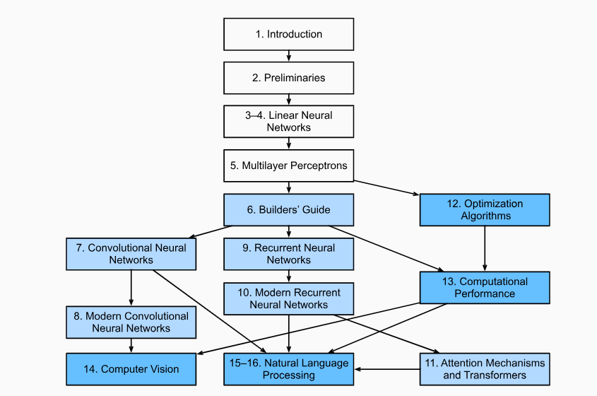

## Estudos Livro: Dive Into Deep Learning

Este repositório é destinado aos meus estudos sobre o livro Dive Into Deep Learning. O livro segue a seguinte estrutura:

Disponíveis no livro físico:

1.  Introduction
2. Preliminaries
3. Linear Neural Networks for Regression
4. Linear Neural Networks for Classification
5. Multilayer Perceptrons
6. Builder's Guide
7. Convolutional Neural Networks (CNNs)
8. Modern Convolutional Neural Networks
9. Recurrent Neural Networks (RNNs)
10. Modern Recurrent Neural Networks
11. Attention Mechanisms and Transformers (LLMs)

Disponíveis apenas na versão online:
Jogar no google: "d2l.ai"

12. Optimization Algorithms
13. Computational Performance
14. Computer Vision
15. Natural Language Processing (NLPs) Pretraining
16. Natural Language Processing (NLPs) Applications
17. Reinforcement Learning (RLs)
18. Gaussian Processes
19. Hyperparameter Optimization
20. Generative Adversarial Networks

